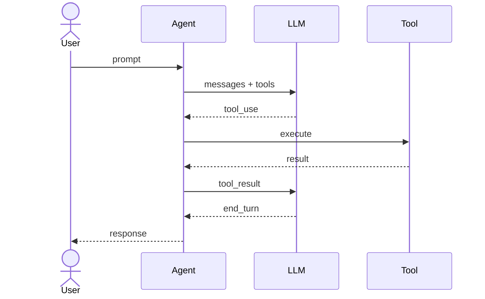

# Obsidian Note Skill

Save teaching plans, lesson notes, and session highlights to the user's Obsidian learning vault.

## Vault Configuration

- **Root**: `/Users/chun-yilin/Documents/Obisidian/vaults/Entrepreneur/Entrepreneur`
- **Attachments**: `<root>/attachments/`
- **Embed syntax**: `![[attachments/filename.ext]]`

## Folder Structure

```
Entrepreneur/
├── Learning/
│   └── {Topic Name}/              ← one folder per course / project
│       ├── 00 學習計畫 - {Topic}.md  ← overview & teaching plan
│       ├── s01 {Lesson Name}.md      ← individual lesson notes
│       └── ...
└── attachments/                   ← ALL images, diagrams, exports
```

## File Naming Conventions

| Type | Pattern |
|------|---------|
| Course overview / teaching plan | `00 學習計畫 - {Topic}.md` |
| Lesson note (match source lesson ID) | `{sXX} {Lesson Name}.md` |
| Session summary | `{YYYY-MM-DD} {Topic}.md` |

## Required YAML Frontmatter

```yaml
---
tags:
  - learning
  - {topic-tag}
created: YYYY-MM-DD
updated: YYYY-MM-DD
source: {url or "in-session"}
status: in-progress | completed
---
```

## Obsidian Formatting Rules

- Internal links → `[[Note Name]]` (no path needed)
- Embedded attachments → `![[attachments/filename.ext]]`
- Callout types:
  - `> [!info]` — background context
  - `> [!tip]` — key insight or mental model
  - `> [!warning]` — gotcha or common mistake
- Tags: frontmatter only, no inline `#tags`
- Headings: H1 = title, H2 = sections, H3 = subsections

## Sequence Diagrams（Mermaid）

Obsidian renders Mermaid natively. Add a sequence diagram when the concept involves **message flow, call order, or multi-party interaction**.

### When to add

| Situation | Add diagram? |
|-----------|-------------|
| A loop or cycle is explained (e.g. agent loop) | ✅ Yes |
| Multiple components interact in sequence | ✅ Yes |
| A dispatch / routing mechanism is explained | ✅ Yes |
| Simple one-step concept | ❌ Skip |

### Format

````markdown

````

### Guidelines

- Keep diagrams **minimal** — only show the key interaction, not every detail
- Place diagram right after the concept explanation, before the code snippet
- Use `-->>` for responses, `->>` for requests
- Label arrows with the actual variable name or message type when helpful (e.g. `stop_reason == "tool_use"`)

## Execution Steps

1. Identify topic, lesson ID, and content type from the current conversation.
2. Determine the target file path: `Learning/{Topic}/{file}.md`
3. **Check if file already exists** (use Read tool on the target path).
   - **Exists** → append new sections or update stale content; update `updated:` date.
   - **Not exists** → create with frontmatter + structured content.
4. If diagrams, code visuals, or images were generated:
   - Save to `<root>/attachments/{descriptive-name}.{ext}`
   - Reference in the note as `![[attachments/{descriptive-name}.{ext}]]`
5. Use `[[wikilinks]]` to cross-reference related notes in the vault.
6. Report to user: exact file path saved/updated, any attachments created.

## What NOT to Do

- Do not create a new file if a note for the same topic already exists — update it instead.
- Do not use absolute paths in wikilinks — Obsidian resolves them automatically.
- Do not put inline `#tags` in the body — use YAML frontmatter only.
